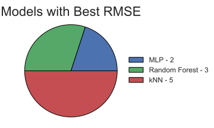

# Looking Back to (Predict) the Future
## Part Two - Exploring Customer Analytics

Galvanize Data Science Immersive | Capstone #3 | September 2018

This is part two of my capstone project using this dataset. Part one can be found [here][1].

### Pat Hottovy
#### Data Scientist
Email: p.hottovy@gmail.com  
Linkedin: [in/patrick-hottovy](https://www.linkedin.com/in/patrick-hottovy/)

## TABLE OF CONTENTS
* [Background](#background)
* [Data](#data)
* [Objectives](#objectives)
* [Approach](#approach)
* [Modeling Techniques](#models)
* [Results](#results)
* [References](#references)
<!-- * [About Me](#about-me) -->

## BACKGROUND

  

In today’s business world, anticipating the needs and wants of your customers is vital to the success of your business. Partnering with [ClickFox][2], the leader in “Customer Journey Analytics,” I was able to gain valuable real-world experience using advanced analytics working with customer data on a current business use case.  

For a particular client, ClickFox provides forecasts for daily, aggregated KPI’s related to key segments of the customer journey. The goal of this project is to both analyze the current process and look for ways to optimize the flow of information going forward.

## DATA
**Since the data comes from a confidential client, there is a limited amount of information I can provide about the data.**

The datasets consist of a number of separate daily feeds containing different customer metrics. For each feed, six different predictions using various time series methods are included. In addition, each daily forecast contains predictions for 14 days into the future. I was provided 10 months of raw data and actuals for these feeds to use for my analysis.

In total, the data included:
* 10 unique feeds
* 6 unique forecast methods for each feed
* Each daily forecast makes predictions 14 days into the future
* I was provided 10 months of data for my analysis

For demonstration purposes, I am going to use two different feeds, which I will call "Feed 0" and "Feed 5" as examples:

![Feed 0 raw][4]
![Feed 0 all six][5]
![Feed 5 raw][6]
![Feed 5 all six][7]

As you can see in the graphs above, Feed 0 is relatively consistent while Feed 5 fluctuates throughout the year. You can also see how much the six forecast methods varies with the actual data.

#### Goal: Find a way to use these predictors to provide the customer with one daily forecast

## OBJECTIVES
* Evaluate the six prediction methods currently being provided to the client
* Analyze the time series data and identify the trends and features that are most indicative of future activity
* Create a workflow from the current process to provide a single daily forecast using either one or a combination of the current predictors

# Step 1: Identify the best predictors per day
Looking at the data, I calculated which of the six prediction methods was closest to actuals in hopes of finding trends between the predictors.

#### Feed 0
![Feed_0_subplots][8]

#### Feed 5
![Feed_5_subplots][9]
**Fig 1: Raw Data compared to the best forecast per day**  
**Fig 2: Raw Data compared to overall best predictor**  
**Fig 3: Composite of the best predictor per day by color (this is the same forecast as Fig 1)**

The third figure for both feeds shows that all six predictors are often the closest for a particular day. Unfortunately, there does not seem to be an obvious trend between the predictors.

## APPROACH
* Unfortunately the previous approach only works if you know the actual amount each day, which defeats the purpose of even making a prediction
* I need to come up with a way to predict which of the predictor or combination of predictors was going to be the "best" each day

# Step 2: Use machine learning to predict the "best" predictor

## MODELING TECHNIQUES
Even though the daily KPI is a continuous variable, the focus of this project was to determine which of the current predictors or combination of predictors provided the best results.

This ultimately turned the project into a multiclass classification problem. I created models and tested the data using the following classification methods:
* k Nearest Neighbors
* Random Forests
* Multilayer Perceptron Neural Network

To evaluate the models, I used root mean squared error (RMSE) to evaluate the models:  

  

<!-- ![rmse][10] -->
<!-- $$ RMSE = \sqrt{\frac{1}{n}\sum_{i=1}^{n}(Y_i - \hat{Y}_i)^2}$$ -->

After running the data through the different models, here is what the MLP predicted for the test set:

![Feed_0_matshow][11]
![Feed_5_matshow][12]
**Target: Shows actual best predictor for test set**  
**Predictions: Shows classification prediction**  
**Pred Probabilities: Shows the predicted probabilities for all six predictors**

Since this particular model predicted predictor_3 for most days, it will result in a low accuracy score. **This is a great example that demonstrates that "accuracy" is not always the best way to measure your model's performance.** The goal of this project is to provide one daily forecast. Even though predictor_3 was not the "best" predictor on a given day, it could still be close to the actual "best" predictor.

Now I need to convert the predictions back to their numeric values and see how they compare to the actual KPI for those days.

#### Feed 0 Results for Each Model:
![Feed_0_MLP][13]
![Feed_0_RF][14]
![Feed_0_KNN][15]

#### Feed 5 Results for Each Model:
![Feed_5_MLP][16]
![Feed_5_RF][17]
![Feed_5_KNN][18]

### Comparison of the Different Modeling Techniques
To evaluate each feed using the same scale, I found it more useful to use the normalized RMSE, which converts the RMSE to the percent difference from actuals.  
One method of calculating this is to divide the RMSE by the mean of the data:

  

<!-- ![nrmse][19] -->

![Top_6_Model_Comp][20]

  

<!-- ![Top_6_Model_Pie][21] -->

<!-- 
## RESULTS
After building a pipeline to test the data, I discovered with this data, all of the classification models provided reasonably similar results. Below are the models that provided the best scores for the different feeds:

![model_pie][5] -->

## References
* ClickFox has proven customer journeys “to be over 30% more predictive than individual events.” Using advanced analytics, ClickFox provides its clients with insights to get the most value out of each interaction with its customers. [clickfox.com/expert-opinions](www.clickfox.com/expert-opinions)

[1]: https://github.com/phottovy/time_series_forecasting
[2]: https://www.clickfox.com
[3]: images/dual_logos.png
[4]: images/raw_data_f0_p1.svg
[5]: images/all_six_f0_p1.svg
[6]: images/raw_data_f5_p1.svg
[7]: images/all_six_f5_p1.svg
[8]: images/top_6_subplots_v2_f0_p1.svg
[9]: images/top_6_subplots_v2_f5_p1.svg
[10]: images/rmse.svg
[11]: images/top_6_matshow_f0_p1.svg
[12]: images/top_6_matshow_f5_p1.svg
[13]: images/top_6_f0_p1_mlp.svg
[14]: images/top_6_f0_p1_rf.svg
[15]: images/top_6_f0_p1_knn.svg
[16]: images/top_6_f5_p1_mlp.svg
[17]: images/top_6_f5_p1_rf.svg
[18]: images/top_6_f5_p1_knn.svg
[19]: images/nrmse.svg
[20]: images/top_6_norm_rmse_by_feed.svg
[21]: images/top_6_pie_by_feed.svg

<!-- [4]: images/git_data_example.svg
[5]: images/git_model_pie.svg
[3]: images/
[3]: images/
[3]: images/ -->
